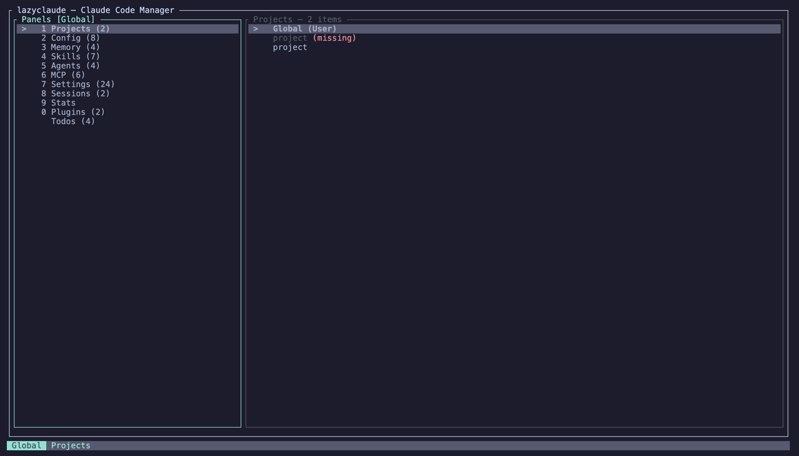

# lazyclaude

A lazygit-inspired TUI for managing Claude Code configuration. One place to view and edit memory, skills, MCP servers, permissions, hooks, instructions, keybindings, agents, sessions, stats, plugins, and todos — across user and project scopes.



## Install

### Homebrew (recommended)

```sh
brew install idossha/lazyclaude/lazyclaude
```

### From crates.io

```sh
cargo install lazyclaude
```

### Prebuilt binaries

Download the latest release for your platform from [GitHub Releases](https://github.com/idossha/lazyclaude/releases/latest), then:

```sh
tar xzf lazyclaude-*.tar.gz
sudo install lazyclaude-*/lazyclaude /usr/local/bin/
```

### From source

```sh
git clone https://github.com/idossha/lazyclaude.git
cd lazyclaude
cargo install --path .
```

## Usage

```sh
lazyclaude                    # launch TUI
lazyclaude --version          # show version
lazyclaude --json             # dump all config as JSON
lazyclaude list mcp           # list a single source as JSON
lazyclaude paths              # show resolved config paths
```

Override paths for custom setups:

```sh
lazyclaude --claude-dir ~/.claude --project-dir /path/to/project
```

Available sources for `list`: `memory`, `skills`, `commands`, `mcp`, `settings`, `hooks`, `claude-md`, `keybindings`, `agents`, `stats`, `plugins`, `todos`.

## Navigation

| Key | Action |
|-----|--------|
| `1-9, 0` | Switch panel directly |
| `j/k` | Move up/down |
| `J/K` | Scroll detail preview |
| `Enter` | Select project / confirm action |
| `l` | Focus detail pane |
| `h/BS` | Back to panels |
| `Tab` | Toggle panels/detail focus |
| `/` | Filter items (fuzzy matching) |
| `Esc` | Clear filter / back |
| `?` | Help |
| `R` | Refresh data |
| `q` | Quit |

Mouse support: click to select panels/items, scroll wheel to navigate.

### Panel actions

| Key | Action |
|-----|--------|
| `e` | Edit in `$EDITOR` (Config/Memory/Skills/Agents) |
| `a` | Add / create item (Settings/MCP/Skills/Agents) |
| `d` | Delete item |
| `u` | Undo last delete |
| `D` | Deny selected permission (Settings) |
| `t` | Toggle server (MCP) |
| `s` | Search registry (Skills/MCP/Plugins) |
| `y` | Copy to clipboard |
| `x` | Export panel data as JSON to clipboard |

### Search overlay

Press `s` on Skills, MCP, or Plugins to open a search overlay:

- Type to fuzzy-filter the list
- `Up/Down` to navigate results
- `Enter` or `y` to install to user scope, `p` for project scope
- `Tab` to preview details
- `Esc` to close
- Items already installed show a checkmark

Skills are sourced from [anthropics/skills](https://github.com/anthropics/skills) and [ComposioHQ/awesome-claude-skills](https://github.com/ComposioHQ/awesome-claude-skills). MCP servers are sourced from the [official MCP registry](https://registry.modelcontextprotocol.io), [npm](https://www.npmjs.com), and [Smithery](https://smithery.ai). Plugins are sourced from local marketplaces and [claude-plugins-official](https://github.com/anthropics/claude-plugins-official).

## Panels

| Key | Panel | Scope | Description |
|-----|-------|-------|-------------|
| `1` | Projects | -- | Switch active project context |
| `2` | Config | User + Project | CLAUDE.md and rules (edit) |
| `3` | Memory | Project | Memory files (edit/delete) |
| `4` | Skills | User + Project | Skill definitions (create/search/install) |
| `5` | Agents | User + Project | Agent definitions (create/edit) |
| `6` | MCP | User + Project | Servers (add/remove/toggle/search) |
| `7` | Settings | User/Project/Local | Permissions, hooks, keybindings (with diff view) |
| `8` | Sessions | Project | Conversation history |
| `9` | Stats | Global | Usage dashboard with charts |
| `0` | Plugins | Global | Installed, blocked, marketplaces (search/install) |
| -- | Todos | Global | Todo items from Claude sessions |

## Features

- **Auto-refresh**: Config files are watched for changes — the TUI updates automatically when you edit files in another terminal
- **Fuzzy search**: The `/` filter and search overlay use fuzzy matching (type `mcpgit` to find `mcp-server-git`)
- **Settings diff**: The Settings panel preview shows per-scope values (user/project/local) so you can see which scope defines each setting
- **Undo**: Press `u` to undo the last delete operation (supports memory, skills, agents, MCP servers, and permissions)
- **Clipboard**: `y` copies the current item, `x` exports the entire panel as JSON
- **Logging**: Diagnostics are written to `~/.claude/lazyclaude.log` (set `LAZYCLAUDE_LOG=debug` for verbose output)

## Architecture

lazyclaude is split into a library (`lazyclaude::config`, `lazyclaude::sources`) and a TUI binary. The library can be used by external tools:

```rust
let paths = lazyclaude::config::Paths::detect();
let data  = lazyclaude::sources::load_all(&paths);
```

The `--json` flag and `list` subcommand output structured JSON, enabling integration with editor plugins, scripts, or other tools.

## Claude Code File Layout

lazyclaude reads configuration from the paths below. This is the canonical reference for what Claude Code stores and where.

### Project Level

```
your-project/
├── CLAUDE.md                         # Project instructions (or .claude/CLAUDE.md)
├── .mcp.json                         # Project-scoped MCP servers
└── .claude/
    ├── CLAUDE.md                     # Alternative location for instructions
    ├── settings.json                 # Project settings (committed)
    ├── settings.local.json           # Local overrides (gitignored)
    ├── rules/                        # Topic-specific rules (recursive)
    │   └── **/*.md
    ├── skills/                       # Skills (subdirectory + SKILL.md)
    │   └── <name>/
    │       └── SKILL.md
    ├── agents/                       # Agents (flat .md files, NOT subdirectories)
    │   └── <name>.md
    └── commands/                     # Slash commands (legacy, prefer skills)
        └── <name>.md
```

### User Level

```
~/.mcp.json                           # User-level MCP servers (cross-tool standard)
~/.claude/
├── CLAUDE.md                         # Personal instructions for all projects
├── settings.json                     # User-wide settings
├── keybindings.json                  # Keyboard shortcuts
├── rules/                            # Personal rules (recursive)
│   └── **/*.md
├── skills/                           # User-level skills
│   └── <name>/
│       └── SKILL.md
├── agents/                           # User-level agents (flat .md files)
│   └── <name>.md
├── commands/                         # User-level slash commands (legacy)
│   └── <name>.md
├── plugins/                          # Installed plugins
│   ├── installed_plugins.json
│   ├── blocklist.json
│   └── known_marketplaces.json
├── todos/                            # Todo items from sessions
│   └── *.json
├── stats-cache.json                  # Usage statistics
└── projects/
    └── <encoded-path>/               # Per-project data
        ├── *.jsonl                   # Session transcripts
        └── memory/
            ├── MEMORY.md             # Memory index
            └── *.md                  # Memory topic files
```

### Organization Level (managed, read-only)

```
macOS:     /Library/Application Support/ClaudeCode/CLAUDE.md
Linux/WSL: /etc/claude-code/CLAUDE.md
```

### Settings Merge Order

Settings are merged with increasing priority: **user < project < local**. Permissions use a three-tier evaluation: **deny > ask > allow** (first match wins).

### Hooks

Hooks are configured inside `settings.json` under the `hooks` key (not a separate file). They are available at all three settings scopes (user, project, local).

### Key Differences

| Item | Format | Location |
|------|--------|----------|
| Skills | Subdirectory with `SKILL.md` | `.claude/skills/<name>/` |
| Agents | Flat `.md` file | `.claude/agents/<name>.md` |
| Commands | Flat `.md` file (legacy) | `.claude/commands/<name>.md` |
| MCP | JSON with `mcpServers` key | `~/.mcp.json` or `.mcp.json` |
| Hooks | JSON inside `settings.json` | `hooks` key in settings |
| Memory | Auto-generated per project | `~/.claude/projects/<encoded>/memory/` |

## Releasing

Tag a version to trigger a release build:

```sh
git tag v0.x.y
git push origin v0.x.y
```

GitHub Actions builds binaries for macOS (x86_64, aarch64) and Linux (x86_64, aarch64), publishes them as a GitHub Release, and automatically updates the [Homebrew formula](https://github.com/idossha/homebrew-lazyclaude).

## License

MIT
